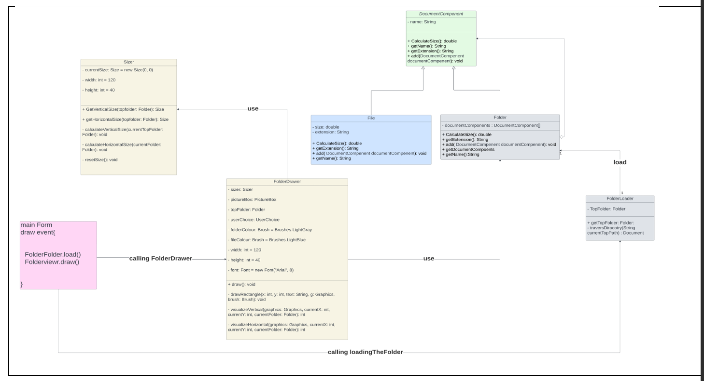

ChatGPT Plus


22f74a68-9da2-4670-a403-662c52336f9a.png
okay this si the my project i want you to write sumrmzie in the readme and i will provide you with the image can yo;u surrmzie it 

Absolutely. Based on your diagram and the project structure, I’d keep the README explanation short, professional, and focused on how the project works, rather than describing every method.

You can paste something like this into your README.md:

# Folder Visualizer

Folder Visualizer is a C# application that reads a directory from the file system and visualizes its folder and file structure.

The application recursively traverses the selected directory, builds an in-memory tree representing folders and files, calculates the required visualization dimensions, and renders the result in either a vertical or horizontal layout.

## Architecture


The project is divided into several main components:

- **DocumentComponent**  
  Defines the common abstraction for files and folders.

- **File**  
  Represents an individual file and stores information such as its name, extension, and size.

- **Folder**  
  Represents a directory and contains a collection of other `DocumentComponent` objects, allowing folders to contain both files and nested folders.

- **FolderLoader**  
  Recursively traverses the selected directory and builds the folder/file object tree.

- **Sizer**  
  Calculates the space required to render the folder structure in vertical or horizontal layouts.

- **FolderDrawer**  
  Uses the generated folder tree and calculated dimensions to draw the visualization.

- **Main Form**  
  Coordinates the loading and drawing process through the application's UI.

## Design Pattern

The core of the project uses the **Composite Design Pattern**.

Both `File` and `Folder` inherit from `DocumentComponent`, which allows the application to treat individual files and groups of files/folders through the same interface.

```text
DocumentComponent
├── File
└── Folder
    ├── File
    ├── File
    └── Folder
        └── File
In this structure:

DocumentComponent is the Component

File is the Leaf

Folder is the Composite

This pattern fits the project naturally because a file system itself has a hierarchical tree structure.

How It Works
User selects a directory
        ↓
FolderLoader
        ↓
Builds Folder / File tree
        ↓
Sizer calculates visualization dimensions
        ↓
FolderDrawer renders the structure
        ↓
Visualization displayed in the UI

I particularly like keeping the **Design Pattern** section because this repo becomes much more interesting when someone looking at your GitHub realizes that it isn't just a folder drawing program—you actually implemented the **Composite Pattern** to model the filesystem hierarchy.

One small suggestion: instead of putting that huge UML image directly at the top of the README, put a short project description first, then the image under **Architecture**. It will make the repository look much cleaner and more professional.

let me downlaod md give me mdfile

Done — here is the Markdown file:

Download README_FolderVisualizer.md 


README_FolderVisualizer.md
Document


c6f4e8b0-9546-441b-8c40-c312b0e155fb.png
image is here

Exactly — since image.png is in the root of the repository, the README should reference it like this:


I updated the Markdown file for you:

Download the updated README.md 


README_FolderVisualizer.md
Document


README_FolderVisualizer.md


Folder Visualizer
Folder Visualizer is a C# application that reads a directory from the file system and visualizes its folder and file structure.

The application recursively traverses the selected directory, builds an in-memory tree representing folders and files, calculates the required visualization dimensions, and renders the result in either a vertical or horizontal layout.

Architecture


The project is divided into several main components:

DocumentComponent
Defines the common abstraction for files and folders.

File
Represents an individual file and stores information such as its name, extension, and size.

Folder
Represents a directory and contains a collection of other DocumentComponent objects, allowing folders to contain both files and nested folders.

FolderLoader
Recursively traverses the selected directory and builds the folder/file object tree.

Sizer
Calculates the space required to render the folder structure in vertical or horizontal layouts.

FolderDrawer
Uses the generated folder tree and calculated dimensions to draw the visualization.

Main Form
Coordinates the loading and drawing process through the application's UI.

Design Pattern
The core of the project uses the Composite Design Pattern.

Both File and Folder inherit from DocumentComponent, which allows the application to treat individual files and groups of files/folders through the same interface.

DocumentComponent
├── File
└── Folder
    ├── File
    ├── File
    └── Folder
        └── File
In this structure:

DocumentComponent is the Component

File is the Leaf

Folder is the Composite

This pattern fits the project naturally because a file system itself has a hierarchical tree structure.

How It Works
User selects a directory
        ↓
FolderLoader
        ↓
Builds Folder / File tree
        ↓
Sizer calculates visualization dimensions
        ↓
FolderDrawer renders the structure
        ↓
Visualization displayed in the UI
